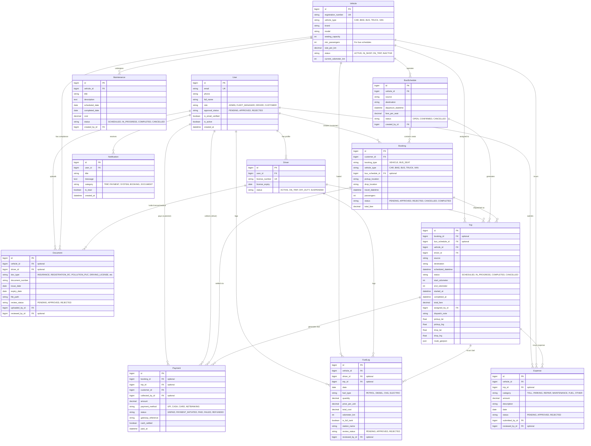

# FleetFlow — Entity-Relationship Diagram (ERD)

This document visualizes the complete database schema, model relationships, and relational foreign keys for the FleetFlow SaaS platform.

```mermaid
erDiagram
    User ||--o{ Driver : "has profile"
    User ||--o{ Booking : "creates (customer)"
    User ||--o{ Payment : "pays (customer)"
    User ||--o{ Payment : "collects (driver)"
    User ||--o{ Expense : "submits"
    User ||--o{ FuelLog : "logs"
    User ||--o{ Document : "uploads"
    User ||--o{ Notification : "receives"
    
    Vehicle ||--o{ Trip : "assigned to"
    Vehicle ||--o{ Maintenance : "undergoes"
    Vehicle ||--o{ FuelLog : "fueled"
    Vehicle ||--o{ Expense : "incurs"
    Vehicle ||--o{ Document : "has compliance"
    Vehicle ||--o{ BusSchedule : "operates"

    Driver ||--o{ Trip : "executes"
    Driver ||--o{ FuelLog : "logs"
    Driver ||--o{ Document : "holds license/medical"

    BusSchedule ||--o{ Booking : "contains seats"
    BusSchedule ||--o{ Trip : "generates"

    Booking ||--o{ Trip : "dispatched as"
    Booking ||--o{ Payment : "settled via"

    Trip ||--o{ Payment : "generates fare"
    Trip ||--o{ FuelLog : "incurs fuel"
    Trip ||--o{ Expense : "incurs expense"

    User {
        bigint id PK
        string email UK
        string phone
        string full_name
        string role "ADMIN, FLEET_MANAGER, DRIVER, CUSTOMER"
        string approval_status "PENDING, APPROVED, REJECTED"
        boolean is_email_verified
        boolean is_active
        datetime created_at
    }

    Vehicle {
        bigint id PK
        string registration_number UK
        string vehicle_type "CAR, BIKE, BUS, TRUCK, VAN"
        string brand
        string model
        int seating_capacity
        int min_passengers "For bus schedules"
        decimal rate_per_km
        string status "ACTIVE, IN_SHOP, ON_TRIP, INACTIVE"
        int current_odometer_km
    }

    Driver {
        bigint id PK
        bigint user_id FK
        string license_number UK
        date license_expiry
        string status "ACTIVE, ON_TRIP, OFF_DUTY, SUSPENDED"
    }

    BusSchedule {
        bigint id PK
        bigint vehicle_id FK
        string source
        string destination
        datetime departure_datetime
        decimal fare_per_seat
        string status "OPEN, CONFIRMED, CANCELLED"
        bigint created_by_id FK
    }

    Booking {
        bigint id PK
        bigint customer_id FK
        string booking_type "VEHICLE, BUS_SEAT"
        string vehicle_type "CAR, BIKE, BUS, TRUCK, VAN"
        bigint bus_schedule_id FK "optional"
        string pickup_location
        string drop_location
        datetime travel_datetime
        int passengers
        string status "PENDING, APPROVED, REJECTED, CANCELLED, COMPLETED"
        decimal total_fare
    }

    Trip {
        bigint id PK
        bigint booking_id FK "optional"
        bigint bus_schedule_id FK "optional"
        bigint vehicle_id FK
        bigint driver_id FK
        string source
        string destination
        datetime scheduled_datetime
        string status "SCHEDULED, IN_PROGRESS, COMPLETED, CANCELLED"
        int start_odometer
        int end_odometer
        datetime started_at
        datetime completed_at
        decimal total_fare
        bigint assigned_by_id FK
        string dispatch_note
        float pickup_lat
        float pickup_lng
        float drop_lat
        float drop_lng
        json route_geojson
    }

    Payment {
        bigint id PK
        bigint booking_id FK "optional"
        bigint trip_id FK "optional"
        bigint customer_id FK
        bigint collected_by_id FK "optional"
        decimal amount
        string payment_method "UPI, CASH, CARD, NETBANKING"
        string status "UNPAID, PAYMENT_INITIATED, PAID, FAILED, REFUNDED"
        string gateway_reference
        boolean cash_settled
        datetime paid_at
    }

    FuelLog {
        bigint id PK
        bigint vehicle_id FK
        bigint driver_id FK "optional"
        bigint trip_id FK "optional"
        date date
        string fuel_type "PETROL, DIESEL, CNG, ELECTRIC"
        decimal quantity
        decimal price_per_unit
        decimal total_cost
        int odometer_km
        boolean is_full_tank
        string station_name
        string review_status "PENDING, APPROVED, REJECTED"
        bigint reviewed_by_id FK "optional"
    }

    Expense {
        bigint id PK
        bigint vehicle_id FK
        bigint trip_id FK "optional"
        string category "TOLL, PARKING, REPAIR, MAINTENANCE, FUEL, OTHER"
        decimal amount
        string description
        date date
        string status "PENDING, APPROVED, REJECTED"
        bigint submitted_by_id FK
        bigint reviewed_by_id FK "optional"
    }

    Document {
        bigint id PK
        bigint vehicle_id FK "optional"
        bigint driver_id FK "optional"
        string doc_type "INSURANCE, REGISTRATION_RC, POLLUTION_PUC, DRIVING_LICENSE, etc"
        string document_number
        date issue_date
        date expiry_date
        string file_path
        string review_status "PENDING, APPROVED, REJECTED"
        bigint uploaded_by_id FK
        bigint reviewed_by_id FK "optional"
    }

    Maintenance {
        bigint id PK
        bigint vehicle_id FK
        string title
        text description
        date scheduled_date
        date completed_date
        decimal cost
        string status "SCHEDULED, IN_PROGRESS, COMPLETED, CANCELLED"
        bigint created_by_id FK
    }

    Notification {
        bigint id PK
        bigint user_id FK
        string title
        text message
        string category "TRIP, PAYMENT, SYSTEM, BOOKING, DOCUMENT"
        boolean is_read
        datetime created_at
    }
```

